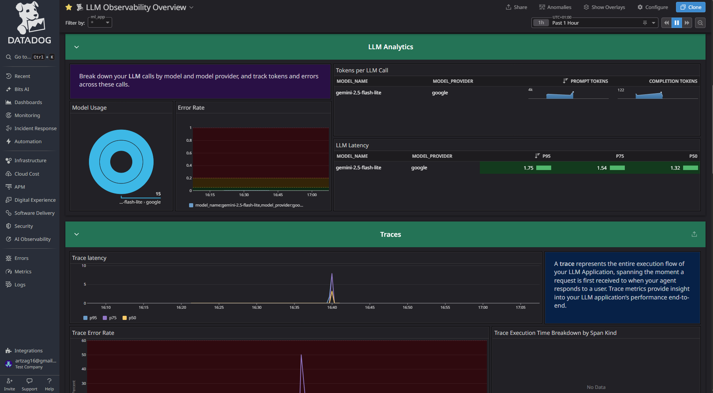
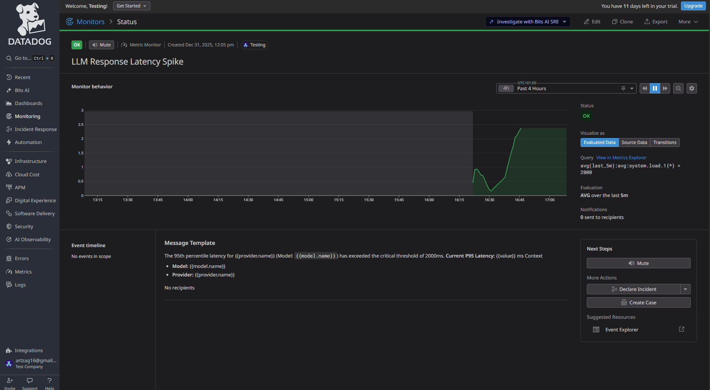
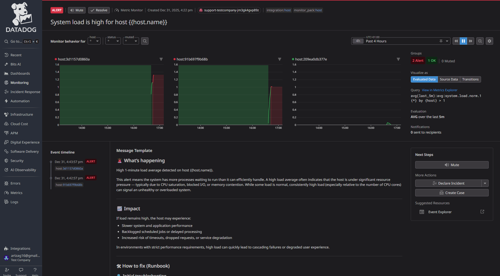

# Telemetry & Observability

Gemini Meet integrates with **Datadog** to provide comprehensive observability into your agents' performance, stability, and usage.

This guide details the available metrics, logs, and traces, along with recommended monitor configurations.

## 1. Setup

To enable Datadog telemetry, set the following environment variables in your `.env` or Docker run command:

```bash
DD_API_KEY=your_datadog_api_key
DD_SITE=datadoghq.com  # or datadoghq.eu, etc.
DD_SERVICE=gemini-meet-agent
DD_ENV=production
# Optional: Enable full APM tracing if running with the Datadog Agent sidecar
# DD_AGENT_HOST=localhost
```

Ensure `DD_LOGS_INJECTION=true` is set to correlate logs with traces.

### Pre-configured Exports

We provide ready-to-import JSON configurations for Monitors and Workflows in the `datadog_exports/` directory.

*   **Monitors**: `datadog_exports/monitors/` contains alerts for Browser Failures, STT Drift, and LLM Latency.
*   **Workflows**: `datadog_exports/workflows/` contains automation workflows (e.g., Slack alerts).

You can import these directly via the Datadog API or Terraform.

## 2. Custom Metrics

We track custom metrics to monitor three critical pillars of the agent's operation: **Browser Automation**, **Speech-to-Text (STT)**, and **LLM Performance**.

### A. Browser Automation (Interaction Failures)

These metrics detect if the headless browser agent is failing to interact with the meeting platform (e.g., join button not found, permissions blocked, crashes).

| Metric Name | Type | Description | Tags |
| :--- | :--- | :--- | :--- |
| `gemini_meet.browser.action_error` | Count | Incremented when a browser action fails. | `action:{name}` (e.g. `join`, `speak_text`), `error_type:{type}` |

** High Browser Failure Rate**
*   **Query**: `sum:gemini_meet.browser.action_error{*}.as_count() > 3` (over 2 minutes)
*   **Why**: Indicates the agent is "stuck" or the meeting UI has changed.

### B. STT Performance (Transcription Health)

These metrics monitor the latency and stability of transcription services (Whisper, Deepgram, Google).

| Metric Name | Type | Description | Tags |
| :--- | :--- | :--- | :--- |
| `gemini_meet.stt.error` | Count | Number of failed transcription attempts. | `stt:{provider}`, `error_type:{type}` |
| `gemini_meet.stt.drift` | Histogram | The lag (seconds) between audio duration and transcription time. High drift = agent falling behind. | `stt:{provider}` |
| `gemini_meet.stt.request` | Count | Total transcription requests. | `stt:{provider}` |

** Transcription Drift**
*   **Query**: `avg:gemini_meet.stt.drift{*} > 2`
*   **Why**: If processing takes >2s longer than the audio itself, the agent cannot respond in real-time.

### C. LLM Performance (Reasoning & Latency)

These metrics track the responsiveness and cost of the LLM providers (Vertex AI, OpenAI).

| Metric Name | Type | Description | Tags |
| :--- | :--- | :--- | :--- |
| `gemini_meet.llm.latency` | Histogram | Time taken (ms) for the LLM to generate a response. | `model:{name}`, `provider:{name}` |
| `gemini_meet.llm.tokens` | Histogram | Total tokens (input + output) consumed. | `model:{name}`, `provider:{name}` |
| `gemini_meet.llm.error` | Count | Number of failed LLM calls. | `error_type:{type}` |

** LLM Latency Spike**
*   **Query**: `p95:gemini_meet.llm.latency{*} > 2000` (over 5 minutes)
*   **Why**: Delays over 2 seconds break the conversational flow in a meeting.

## 3. Logs

Gemini Meet produces structured JSON logs. The Dashboard uses these logs to reconstruct:
1.  **Meeting Transcripts**: By parsing logs tagged with `meeting_id`.
2.  **Tool Usage Stats**: By counting specific log patterns from the agent.

**Important**: Ensure your Datadog Log Index retention is sufficient (e.g., 7-15 days) if you want to view historical meeting details in the dashboard.

## 4. Traces (APM)

APM tracing is supported for detailed performance analysis of:
*   **LLM Calls**: View exact prompts and completions in the Trace view.
*   **Tool Execution**: See how long each tool (e.g., `brave_search`, `speak_text`) took to run.
*   **Startup Sequence**: Analyze container startup and browser initialization times.

## 5. Screenshots

Here are examples of Datadog dashboards and monitors in action:






